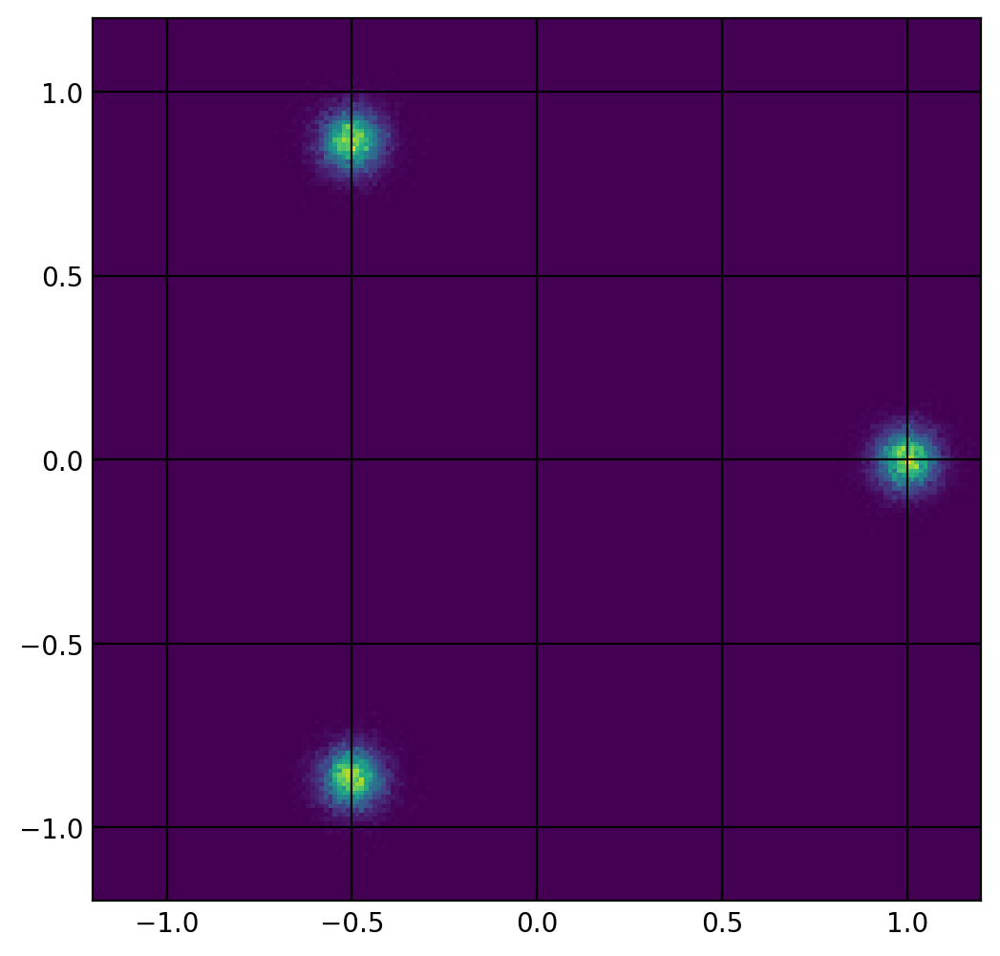

# GAN Vis

A Generative Adversarial Network with a synthetic, multimodal, 2D data set.
Visualization during training shows the output from the generator and a heat map
of the response of the discriminator.

## Usage
### Requirements
This code uses Tensorflow v1 (in compatibility mode, should run with a TF2 install).

To generate videos you need `ffmpeg`, I recommend you install via Homebrew on MacOS or your package manager in Linux.

### Training
```shell
python train.py --model=standard --log-dir=vis_standard --vis-dir=vis_standard/steps
```

Valid models are: `{standard, dropout, infogan, wgan}`

Models have additional hyperparameters that are not exposed via args, have a look at the code.


### Making a Training Video

Once all the steps are rendered in a directory, they can be compiled into a video with `ffmpeg` like this:

```shell
ffmpeg -r 30 -i vis_standard/steps/step_%d.png -c:v libvpx-vp9 -crf 30 -b:v 0 -pix_fmt yuv420p output.webm
```

Render a chart of the G and D training losses with:

```shell
python make_plot.py <tfevent file> [--save-path=FILE_PATH] [--max-steps=STEPS]
```

## Dataset
`data3.csv` is a pregenerated 2D dataset with 3 modes distributed around the unit circle. See the density plot below:


