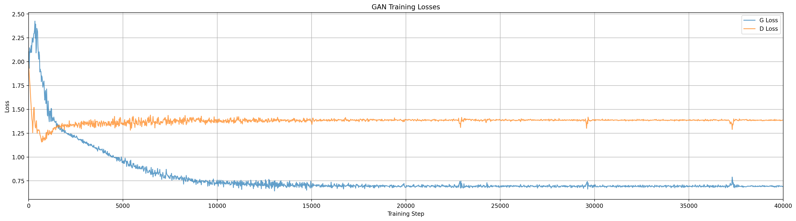

Author: Max Pflueger

Original draft: July 2017<br/>
Published: June 2025

{: .center width="300px"}

*Author’s Note: I largely wrote this in 2017, but didn’t publish it at the time.  Reviewing now in 2025 some things have changed (to say the least), but I still think there is value in looking at some of these older more basic techniques.  I’ve decided to preserve what I wrote then, editing for clarity and correctness, even where some of it may seem anachronistic. I've rerun all the experiments to verify everything reproduces and also added a bit where a thought more explanation was needed.*

I’ve been playing with Generative Adversarial Nets (GANs) a bit lately, and as probably anyone who has used them knows, training is tricky.  In particular, I wanted to understand what was happening when my network didn’t capture the variety of my data.  Fortunately, if you synthesize a low dimensional data set, it is possible to make some nice visualizations and animations of what the network, or networks rather, do as they are training.

# First, a bit about GANs
If you’ve used GANs before and know what they are all about, you can probably go ahead and skip this section.

## Generative Algorithms are Useful
To start, let’s talk about what GANs are trying to achieve. Many people are familiar with machine learning or deep networks in the context of discriminative algorithms, which take an input data point and tell us what distribution it came from.  For example, we might put an image into our algorithm and expect it to tell us if it was a picture of a cat or a dog (in this context we think of the space of all possible cat pictures as being a probability distribution across all possible images).  Generative algorithms go in the other direction, we ask it for an image of a cat, and it [generates a random picture of a cat for us](https://ajolicoeur.wordpress.com/cats/).  We can go a step further and separate generative algorithms that represent the probability density explicitly from those that do so implicitly (GANs are implicit), but that is beyond the scope of this article.

Why would we want a generative algorithm? Well, first of all, perhaps we believe the internet needs an unlimited supply of algorithmically generated cat pictures.  But more generally, they give us a better understanding of the distribution of our data (or at least what can be learned about that distribution) and are another tool in our machine learning toolbox.

## How GANs Work
Generative adversarial networks have gotten a lot of attention recently as an approach to use the techniques of deep learning for creating a generative algorithm, and they have delivered some impressive results.  The fundamental idea behind GANs is a relatively simple trick for finding a way to train a neural network that will generate points that look like points in your dataset.  At first blush it is not too difficult to set up a neural network that will take as input some random noise and output data points in the same dimensionality as your dataset, but to train such a network we need an error signal that can be backpropagated to apply the gradient descent algorithm of our choice.  Getting that error signal (“How cat-ish is this image?”) is non-trivial, and is probably about as hard as training the generator itself.  But actually, this sounds like something we know how to do!  Construct a normal, discriminative network that will say whether an image looks like a cat or not, but again, how do we train that network?  It has already been demonstrated that it is relatively easy to produce nonsense images that will be labeled as real things by classifiers with great certainty \[[Nguyen et. al.](https://arxiv.org/pdf/1412.1897.pdf)\].

So here we are, if we had a good cost function we could train the generator, and if we had a way to get enough of the right sort of data we could train a network to be a cost function.  The great insight of GANs is that we can solve this chicken and egg problem using *adversarial* training to train that cost function *simultaneously* with the generator itself.  By pitting two networks against each other (in a battle to convergence!), where one tries to generate samples that look like our data and the other tries to tell the artificial samples from the real data, we can produce networks that are very good at both tasks.  We call these two networks the generator and the discriminator, or $$G$$ and $$D$$.

Formally, we are optimizing the cost function below:

$$
\min_G \max_D V(D,G)=\mathbb{E}_{\boldsymbol x \sim p_{data}(\boldsymbol x)}\left[\log D(\boldsymbol x)\right] + \mathbb{E}_{\boldsymbol z \sim p_{\boldsymbol z}(\boldsymbol z)}\left[\log (1-D(G(\boldsymbol z))) \right]
$$

There are a couple variants on how to do that optimization, but the most basic approach is to take a gradient step on the weights of $$D$$, and then a gradient step on the weights of $$G$$, and repeat.  **What happens when we do that optimization is what this article is all about.**  In practice, adversarial training can be unstable, or it can get stuck in local minima.  To understand what that means, why it happens (at least to some extent), and what we might do about it, I made the visualizations below.  I found them illuminating, and I hope you will too.

For a more thorough explanation of GANs you can read the original paper by Ian Goodfellow \[[Goodfellow et. al.](https://arxiv.org/abs/1406.2661)\], and when you have grip on the basics, you could check out the [GAN Zoo](https://github.com/hindupuravinash/the-gan-zoo) to see how many variants there are I haven’t discussed or visualized here (the answer is a lot).


# Visualizing Training

## Synthetic Data
To train the GANs in the visualizations below, I used a synthetic data set designed to show a particular weakness of the GAN model, multi-modal data.  The data points exist in a 2 dimensional state space, drawn from one of three normal distributions, with the mean values evenly spaced around the unit circle.  The dataset consists of 30000 samples, 10000 from each mode.  Visually, the density of the data in the state space looks like this:

{: .center width="400px"}

## Visualization
I made the visualizations below to help understand the GAN training process.  In particular, I wanted to be able to see the behavior of both the generator and discriminator.  

In the state space of our synthetic training data, the discriminator is a function D:R<sup>2</sup>->(0,1), which means we can fully visualize its behavior by mapping each pixel to a color according to what D would say about a data point in the position of that pixel.  Then, to understand the distribution of data being produced by the generator we plot all its samples from a single batch directly onto the decision surface of the discriminator.  This means that for each frame we get to see both what the distribution looks like coming out of the generator, how well that is conforming to what the discriminator thinks real data looks like, and (if we remember what our synthetic data looks like) how well both of those match the actual distribution of the training data.

Obviously, this technique only works because we are using data from a 2-dimensional state space.  Most interesting applications of GANs happen on complex, high dimensional data like images, but hopefully, by starting small, we can get some insight into the dynamics of adversarial training.

# Training Animations
I used python and TensorFlow to create these visualizations, and you can find the code [here](https://github.com/mpflueger/gan-vis).  If you want to play along at home, check out the code, and I’ve included the command to start the training process shown in each video.  But be aware, your results may differ, this process has a lot of random variation.

Also note that these algorithms have a lot of hyperparameters, some explicit, some less so.  I tried to pick typical values to produce interesting behavior, but have not done an exhaustive parameter sweep by any means.  If you are curious I encourage you to pick up the code, change something, and see what you see!

## Vanilla GAN
Our first contender is a vanilla GAN with no fancy modifications.  In the video below you will see how the generator ‘collapses’ onto a single mode of the data, and ignores the others.  The phenomenon of ‘mode collapse’ is an important form of local minimum where the generator only produces samples that look like a subset of the training data.  The visualization below should help us get an intuitive understanding of how and why this happens.

```shell
python train.py --model=standard --log-dir=vis_standard --vis-dir=vis_standard/steps
python make_plot.py vis_standard/...
ffmpeg -r 30 -i vis_standard/steps/step_%d.png -c:v libvpx-vp9 -crf 30 -b:v 0 -pix_fmt yuv420p standard.webm
```
{: .center}

**Note: These videos are long, but the interesting bits are very short and spread throughout. I recommend scrubbing through to find the steps where things change.**

We see that the generator essentially ‘chases’ the discriminator around the space, but it only knows where to go based on the samples it has produced, this is adversarial gradient descent at work.  Once it has calmed down the generator is usually producing data that looks like one of the three modes, and getting some reward for doing so, but has no gradient to spread out.  Sometimes (randomly) the generator will manage to split its distribution and capture two modes at once, but I have yet to see it grab all three.  

### Is a One Mode Generator Stable?

This could probably be a more complex question than I’m going to address here, but let’s just look at a simple case: Suppose the data has 3 modes, and the generator has perfectly matched one of them.  What is the optimal discriminator?  We assume the discriminator can perfectly separate the modes, but the generated data points and true data points are indistinguishable in one of the three modes.  In this case the discriminator simply has to choose 3 values

$$\{D(m_1), D(m_2), D(m_3)\} \in [0,1]$$

If $$G(\boldsymbol z)=m_1$$ then clearly $$D(m_2)=D(m_3)=1$$, but $$D(m_1)$$ depends on the relative weights of the training data and generator. In our problem $$m_1$$ is $$\frac{1}{3}$$ of the data and the generator and data have equal weight.  We are now solving:

$$\arg\!\max_{D(m_1)} \left[ \frac{1}{3}(\log D(m_1)) + \log(1-D(m_1)) \right] = \frac{1}{4}$$

Depending on the noise in our training process, this may be enough weight to prevent the generator from shifting to a new mode (by creating a local optimum around that mode to 'trap' the generator), though it will likely depend heavily on hyperparameters.  In the examples I've seen mode shifts continue to happen pretty late through training (though one could imagine setups such as a learning rate decay (not implemented here) that would change this).

## Dropout
What can we do to avoid mode collapse? One common tool in our neural network toolbox is dropout (where we randomly zero out some neurons in our network).  Applying dropout to a generative network is a slightly funny idea, since it looks a lot like adding extra random input variables, but let’s try it and see what happens.

```shell
python train.py --model=dropout --log-dir=vis_dropout --vis-dir=vis_dropout/steps
```
{: .center}

*[TODO: is this redundant with main text?] The network noise caused by dropout causes the generator to produce a wider distribution than in the standard model, but in this run it still only manages to capture a single mode of the data distribution.*

As with all the examples in this article, this plays out a little different every time, but we do see the dropout noise causing the generator distribution to spread a lot more early in training.  Unfortunately, most of the time it still only captures a single mode (at least with the parameter settings I’m using here).

## InfoGAN
Next, lets try a technique called InfoGAN \[[Chen et. al.](https://arxiv.org/pdf/1606.03657.pdf)\]. 
InfoGAN introduces a new input variable $$c$$ and modifies the generator loss function to also maximize mutual information with $$c$$, which is done by adding a network $$Q$$ that attempts to predict $$c$$ from the output of $$G$$.  Theoretically there are no constraints on the distribution of $$c$$, for our problem we make it a categorical one-hot variable.
With categorical modes, this will essentially force the generator to produce separable modes according to the input $$c$$ variable.  

We will have to choose the dimension of $$c$$ (number of categories) beforehand, which becomes another hyperparameter in our training process.  Choosing reasonable distributions for $$c$$ should be easy with our synthetic data, but it might be more difficult if we are dealing with a complex, high dimensional data set; but one problem at a time!  In the next example, we gave $$c$$ dimension of 3:

### Runs at $$c=3$$
```shell
python train.py --model=infogan --c=3 --log-dir=vis_infogan_c3 --vis-dir=vis_infogan_c3/steps
```
{: .center}

*REVIEW NOTE: is it worth keeping this video?*

{: .center}


Cool! With $$c=3$$, sometimes the generator will immediately split out to capture all 3 modes, but that isn’t always the case, as we see above. Two of the generator modes got stuck on one of the data modes for quite a while, and eventually, around step 71000, got shaken loose by random noise. (This noise arrives in the form of random samples drawn from the data distribution and random samples from the generator, both of which feed to the discriminator gradient updates.)  It is worth considering though, that if we had just been looking at the loss plot, we might have already stopped training by that point, as it would have looked stagnant for a while.  Maybe we can reduce the chances of missing a mode by increasing $$c$$ to 6 modes:

### Runs at $$c=6$$
By increasing the generator modes to 6 we increase the odds that all modes of the data will be captured, but even in an ideal case where 2 generator modes attach to each data mode, this will not be a good model of the data due to the cost function that tries to keep the generator modes separable.  We see that the discriminator attempts to exploit this by selecting the region between each pair of generator modes that have attached to data mode.  In other cases we could see one data mode with 3 generator modes, and another with 1, and this will make the data representation of the generator even worse.  Remember that this model cannot learn the relative weights of the generator modes (values of $$c$$), so if our different data modes have weights that are different from our generator modes, the generator cannot match this through learning.

Here we see two different ways this can turn out (there are probably more, but these are the ones I see most often), so we are back to the point of having to be a little lucky in the training process.

```shell
python train.py --model=infogan --c=6 --log-dir=vis_infogan_c6 --vis-dir=vis_infogan_c6/steps
```
{: .center}

*Here the generator successfully assigns 2 modes to each of the three data modes.  We then see an interaction where $$G$$ is forced to keep the modes separable, and $$D$$ tries to detect the space between them as real data. With $$G$$ relatively stable we also see artifacts developing in $$D$$ in the rest of space.*

{: .center}

*There is no guarantee of getting an even assignment of generator modes to data modes, as we see in this run with the same settings as above.*

### Runs at $$c=20$$
Making $$c$$ substantially larger than the number of modes of our data could be an approximate mitigation to the issues above, here are a couple training runs with $$c=20$$:

```shell
python train.py --model=infogan --c=20 --log-dir=vis_infogan_c20 --vis-dir=vis_infogan_c20/steps
```

{: .center}

*In this run the generator initially only captured two data modes, but later around step 21000 managed to migrate out to the third. In the loss plot we see a corresponding increase in the discriminator loss at that point.*

{: .center}

*In this run the generator has mostly stabilized on the data modes by step 2000, though not with equal weight.  Through the remainder of the training video we can see how the discriminator contours react.*

Qualitatively this looks pretty good, though it is also clear that the modal nature of the generator is creating artifacts in its representation of individual data modes.  Depending on the application this may be acceptable, or we may be able to further increase $$c$$ until the artifacts were sufficiently small to not matter, however, this is not likely to go away entirely without further algorithmic tweaks, and of course we had to choose $$c$$ as a hyperparameter related to the nature of our data.

## Wasserstein GAN (WGAN)
The Wasserstein GAN (proposed by \[[Arjovsky et. al.](https://arxiv.org/abs/1701.07875)\]) is designed to address stability issues in GAN training by using a different loss function for the generator that is designed to make smooth convergence more likely.  Arjovsky et. al. develop theory for this approach that leads to using a critic based on the Earth Mover distance between distributions.  They propose an approximation of that metric that looks very similar to our standard GAN, where we rebrand the discriminator as a critic and clip the weights of critic to a set range (my implementation uses -0.1 to 0.1). Another key difference with a standard GAN is that in WGAN we should train the critic to convergence.  My implementation doesn’t do that exactly, but increases gradient updates on the critic to 5 per generator update, vs 1 in a standard GAN (`k` in `GanModel`).

This deceptively simple change to the GAN algorithm has a significant impact on training dynamics, and in many training runs I see the generator being forced to spread out and capture multiple modes of the data distribution.

```shell
python train.py --model=wgan --log-dir=vis_wgan --vis-dir=vis_wgan/steps
```
{: .center}

*Training the Wasserstein GAN.  By contrast to the other models here we see the generator spread and bifurcate to capture multiple modes of the data.  The discriminator (critic) field also has visually different contours than in the other models.*

# Conclusion
These models all still have some issues, for example in most cases the generator does not appear to be particularly stable during training.  Even in models that capture all the modes, those modal distributions can move around a lot randomly.  It is also not clear if they are accurately capturing the shape of each individual data mode.  We can perhaps imagine a number of tweaks to address these issues, such as tweaking the relative updates of $$G$$ and $$D$$, learning rate decay, etc., but that would introduce more hyperparameters that would have to be tuned for each application.  Unsurprisingly then, there are many other approaches in the literature for helping GANs get good results.  If I end up implementing them, perhaps I will update this post later.

If you are curious I encourage you to check out the [code](https://github.com/mpflueger/gan-vis), and play with some of the hyperparameters to see how they affect the training process. And if you have a favorite GAN variant you want to see analyzed this way I encourage you to fork the code and try it out. Maybe write a follow up to show us what you found!

## Reflections in 2025

I haven’t seen people using GANs much lately, but I think there are a couple lessons I took away from this that continue to be relevant to machine learning today.  One is regarding the stability of learning dynamics.  Watching the generator distribution ‘orbit’ a single data mode without either settling on the mode or expanding the generator distribution to find better minima really illustrates that gradient descent is not an ‘intelligent’ process, and has complex dynamics unto itself.  Training dynamics have been studied in many ways in many contexts, but it is still striking to see it illustrated like this.

A second lesson is regarding the artifacts of network architecture, observed through the shapes produced by the discriminator.  My code uses the relu non-linearity, which makes the surface of the discriminator piecewise-linear, and sometimes we see shapes that hint at this.  Furthermore, we see that the discriminator doesn’t learn anything it doesn’t have to, so anything outside the range of the generator samples or data samples is just noise shaped by our inductive biases (non-linearities, architectures, initializations, etc.).  This should offer some insight any time we ask an ML model to ‘extrapolate’ beyond the range of what has been seen in training.

Finally, as we look at these learning architectures, we see a number of issues, like mode distributions in InfoGAN, that cannot be fixed by simply making the model larger.  The field of machine learning has seen many significant breakthroughs that appeared to be a result of simply having more compute or more data, but just as often we see issues that bigness cannot fix, and require us to develop an understanding of the underlying mechanisms and dynamics of our algorithms.

I hope you found this interesting, and if you’d like to ask questions or talk about it feel free to contact me via email or social media.
